# OpsPilot AI v4 — Complete Working Product, Architecture, Feature Register and Flowcharts

## Document purpose

This document is the consolidated implementation blueprint for the complete OpsPilot AI product.

It combines:

- the complete SaaS feature specification,
- the original architecture and implementation blueprint,
- universal language/framework/database/queue/SDK support,
- large polyglot repository support,
- repository indexing and architecture graphs,
- hybrid RAG, GraphRAG, runtime RAG, documentation RAG and retry/fallback,
- a custom agentic AI runtime implemented from scratch,
- static analysis,
- isolated runtime execution,
- automatic HTTP/browser/WebSocket/webhook/queue workflow execution,
- dynamic debugging across frontend, backend, databases, background jobs, infrastructure and external SDKs,
- automatic remediation and test-and-repair,
- approval-controlled Git and infrastructure changes,
- production telemetry, incident response, recovery and rollback,
- frontend visibility for recruiters and users,
- security, billing, administration, evaluation and extensibility.

This is an implementation target, not a claim that every feature must be completed in the first release.

---

# 1. What you are building

**OpsPilot AI** is a multi-tenant, adapter-driven, agentic AI software reliability platform.

A user connects a repository. OpsPilot then:

1. determines what technologies exist,
2. decomposes the repository into applications, services, workers and packages,
3. parses and indexes the code,
4. builds an evidence-backed architecture graph,
5. performs deterministic static analysis,
6. creates or discovers end-to-end business workflows,
7. safely runs the application inside an isolated environment,
8. sends its own HTTP, browser, GraphQL, WebSocket, webhook, event and queue traffic,
9. verifies every stage of the result,
10. localizes the first failed stage,
11. investigates competing root-cause hypotheses,
12. proposes an exact code, configuration or infrastructure correction,
13. applies that correction only inside a temporary sandbox branch,
14. rebuilds and replays the original workflow,
15. rejects the correction when verification or regression checks fail,
16. presents the verified change and asks for approval,
17. creates a Git pull request or performs an approved infrastructure action,
18. monitors recovery and rolls back an unsuccessful action.

For production-connected applications, it also correlates live code versions with logs, metrics, traces, queues, databases, SDK errors, containers, Kubernetes and deployment events.

## Honest product promise

> Connect a repository, understand its architecture, discover static and runtime failures, actively exercise complete user workflows, identify the failed stage with evidence, generate and verify a correction in isolation, and ask for approval before the change leaves the sandbox.

## Honest universality promise

> OpsPilot provides generic ingestion and analysis for normal repositories and progressively deeper syntax, semantic, runtime and verified-repair support through technology adapters.

It must not claim:

> OpsPilot solves every software error in every repository.

---

# 2. Primary product modes

| Mode | User input | What OpsPilot does | Main result |
|---|---|---|---|
| Repository Audit | Repository and commit | Indexes, understands architecture and runs static checks | Architecture, findings and risks |
| Runtime Lab | Repository plus test configuration | Builds and runs the system in isolation | Reproduced runtime failures |
| Workflow Verification | Business workflow | Drives the complete workflow and verifies every stage | Passed workflow or localized failure |
| Verified Repair | Failed workflow or issue | Generates, applies and tests a correction in sandbox | Verified diff awaiting approval |
| Production Incident Response | Repository plus live telemetry | Correlates runtime evidence with source and deployments | Root cause and remediation |
| Architecture Explorer | Repository | Builds interactive service/data/event/SDK maps | Searchable system graph |
| Natural-Language Assistant | Question or objective | Uses RAG, tools and evidence | Answer, investigation or action plan |
| Evaluation Lab | Seeded failures and benchmarks | Measures RAG, agent, repair and safety performance | Accuracy, cost and regression metrics |

---

# 3. Complete feature register

The architecture includes the following product capabilities.

## A. SaaS and workspace features

1. Email/password authentication  
2. GitHub OAuth  
3. Google OAuth  
4. Email verification  
5. Password reset  
6. Two-factor authentication  
7. Session and login-history management  
8. Organizations and personal workspaces  
9. Team invitations  
10. Organization switching  
11. RBAC and custom permissions  
12. Organization-specific projects and integrations  
13. Subscription plans  
14. Usage-based metering  
15. Upgrade, downgrade, trials and invoices  
16. Plan-limit enforcement  
17. Usage dashboard and cost-per-investigation  
18. Audit logs  
19. Notifications by email, Slack and webhook  
20. Internal platform administration  
21. Feature flags  
22. Data export, retention and deletion  

## B. Repository and source-control features

23. GitHub App installation  
24. Public and private repository connection  
25. Repository, branch and monorepo-directory selection  
26. Immutable commit snapshots  
27. Push-webhook synchronization  
28. Pull-request analysis  
29. Manual re-indexing  
30. Git history, diff and blame tools  
31. Agent branches, commits and pull requests  
32. GitHub check/status integration  

## C. Universal compatibility features

33. Language detection  
34. Framework detection  
35. Build-system and package-manager detection  
36. Database detection  
37. Cache, queue and background-job detection  
38. SDK and external-integration detection  
39. Docker, Kubernetes, CI/CD and infrastructure detection  
40. Capability-level reporting  
41. Language-adapter registry  
42. Framework-adapter registry  
43. Database-adapter registry  
44. Messaging/background-job adapter registry  
45. External-SDK adapter registry  
46. Generic unknown-technology fallback  
47. Version-aware documentation resolver  
48. Adapter/plugin SDK  

## D. Repository intelligence features

49. File classification and filtering  
50. Secret and binary exclusion before indexing  
51. Tree-sitter parsing  
52. LSP/compiler semantic analysis  
53. AST-aware chunking  
54. Symbol, definition and reference indexing  
55. Cross-file call relationships  
56. Service/workspace/package decomposition  
57. Request/response contract extraction  
58. Database model and query extraction  
59. Queue producer/consumer mapping  
60. SDK and webhook relationship extraction  
61. Docker/Kubernetes/deployment extraction  
62. Evidence-backed architecture graph  
63. Incremental content-addressed indexing  
64. Hierarchical summaries for very large repositories  
65. Architecture comparison between commits  

## E. RAG and knowledge features

66. Code RAG  
67. Lexical/BM25 retrieval  
68. Exact symbol and error search  
69. Architecture GraphRAG  
70. Runtime RAG  
71. Documentation RAG  
72. Incident-memory RAG  
73. Project/team knowledge  
74. Query decomposition  
75. Retrieval fusion and reranking  
76. Parent/child and caller/callee expansion  
77. Service and commit filtering  
78. Retrieval quality gates  
79. Query rewrite and retry  
80. Alternative retriever fallback  
81. Context compression and overflow recovery  
82. RAG observability and evaluation  

## F. Agentic AI features

83. Durable custom orchestrator  
84. Explicit state machine  
85. Planner and replanner  
86. Query/workflow router  
87. Context builder  
88. Model gateway and fallback  
89. Structured-output validation  
90. Tool registry and executor  
91. Hypothesis engine  
92. Evidence manager  
93. Working memory  
94. Project memory  
95. Episodic incident memory  
96. Team and policy memory  
97. Risk and policy engine  
98. Human approval manager  
99. Checkpoint and resume  
100. Retry scheduler  
101. Budget and loop controller  
102. Multi-agent dispatcher  
103. Agent tracing and evaluation  

## G. Static-analysis features

104. Compiler/build validation  
105. Linting and formatting checks  
106. Missing import and dependency analysis  
107. Dead-code and unused-export detection  
108. Complexity and duplicate-logic detection  
109. Async, cleanup and resource-leak checks  
110. Environment-variable validation  
111. Docker/Compose validation  
112. Kubernetes/Helm validation  
113. CI/CD and Nginx validation  
114. Database schema and query checks  
115. Secret scanning  
116. Dependency-vulnerability scanning  
117. Authentication and authorization checks  
118. CORS, injection, path and upload security checks  
119. SDK-specific deterministic rules  

## H. Runtime and testing features

120. Secure ephemeral sandbox  
121. Automatic build-command discovery  
122. Dependency and service startup  
123. Database migrations and test-data seeding  
124. HTTP and REST drivers  
125. GraphQL drivers  
126. WebSocket and SSE drivers  
127. Browser automation  
128. Webhook simulation  
129. Queue/event publication  
130. Background-job tracking  
131. gRPC support through adapters  
132. Test-user and fixture management  
133. Distributed correlation IDs  
134. API contract assertions  
135. Database, cache and queue assertions  
136. SDK/provider assertions  
137. Final UI/business-outcome assertions  
138. Unit, integration and E2E test execution  
139. Agent-generated temporary tests  
140. Load and throughput testing  
141. Concurrency and idempotency testing  
142. Failure and chaos injection  
143. Performance, resource and resilience reporting  

## I. Debugging and repair features

144. Last-correct/first-failed-stage localization  
145. Competing root-cause hypotheses  
146. Supporting and contradicting evidence  
147. Confidence and missing-evidence reporting  
148. Code/configuration/infrastructure correction planning  
149. Exact multi-file change generation  
150. Temporary sandbox branch application  
151. Original-failure replay  
152. Regression/security/performance gates  
153. Bounded test-and-repair loop  
154. Automatic rejection of unsafe or unverified changes  
155. Risk and blast-radius explanation  
156. Rollback plan  
157. Approval before external change  
158. PR generation after approval  
159. Recovery monitoring  
160. Automatic rollback when recovery fails  

## J. Production and incident features

161. OpenTelemetry ingestion  
162. Logs, metrics and traces  
163. Docker and Kubernetes events  
164. Database and queue health  
165. SDK/provider events  
166. Deployment-to-commit correlation  
167. Alerting and anomaly detection  
168. Incident grouping and deduplication  
169. Incident timelines  
170. Collaboration, comments and assignment  
171. Approval-controlled remediation  
172. Postmortem generation  
173. Reliability and monthly reports  
174. PDF, Markdown, JSON, GitHub and webhook exports  

## K. Platform engineering features

175. Public API  
176. Product webhooks  
177. Node.js/Python/telemetry SDKs  
178. Connector/plugin system  
179. MCP-compatible tool access where appropriate  
180. Tenant isolation  
181. Secret encryption and rotation  
182. Prompt-injection protection  
183. Execution quotas and network policies  
184. Dead-letter jobs and circuit breakers  
185. Admin operational controls  
186. Benchmark and release-quality gates  

The system does not need all 186 capabilities in the first version. This register defines the complete target product.

---

# 4. Master system architecture

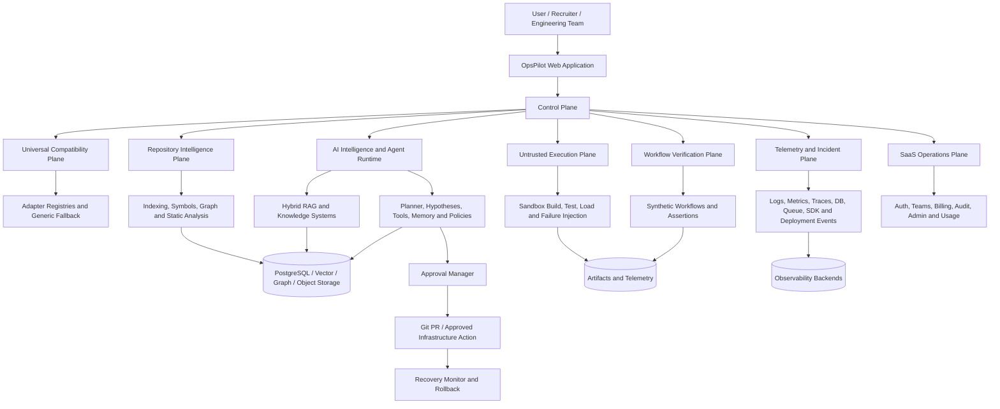

## Architectural planes

### 1. Control plane

Owns:

- authentication,
- organizations,
- RBAC,
- projects,
- repository integration,
- analysis requests,
- agent-run control,
- approvals,
- billing,
- audit and notifications.

### 2. Universal compatibility plane

Owns:

- technology detection,
- capability levels,
- adapter selection,
- generic unknown-technology fallback,
- build/runtime resolution,
- version-aware documentation.

### 3. Repository intelligence plane

Owns:

- parsing,
- symbols,
- references,
- service decomposition,
- contracts,
- architecture graph,
- static analysis,
- incremental indexing.

### 4. AI intelligence plane

Owns:

- all RAG systems,
- context construction,
- planner/replanner,
- hypotheses,
- tools,
- memory,
- evidence,
- policy,
- model gateway,
- evaluation.

### 5. Untrusted execution plane

Owns:

- isolated environments,
- dependencies,
- application startup,
- tests,
- load,
- concurrency,
- failure injection,
- patch verification.

### 6. Workflow verification and remediation plane

Owns:

- workflow discovery,
- synthetic traffic,
- side-effect assertions,
- failure localization,
- correction generation,
- verification,
- approval and rollback.

### 7. Telemetry and incident plane

Owns:

- logs,
- metrics,
- traces,
- deployments,
- DB/queue/provider events,
- incident correlation,
- production remediation.

### 8. SaaS operations plane

Owns:

- plans,
- usage,
- invoices,
- quotas,
- retention,
- administration,
- operational health.

---

# 5. Complete user journey

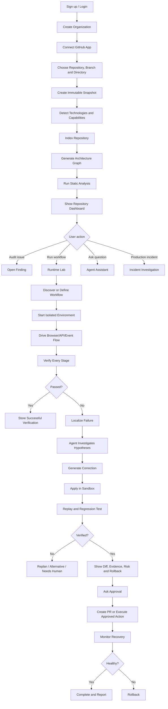

---

# 6. Repository onboarding workflow

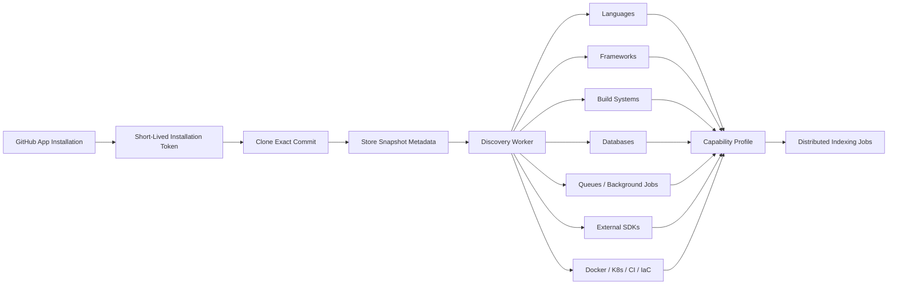

## Onboarding stages visible in the frontend

```text
✓ Repository access verified
✓ Snapshot created at commit abc123
✓ 6 languages detected
✓ 11 applications/services detected
✓ 4 databases/caches detected
✓ 3 queue/background systems detected
✓ 17 external integrations detected
✓ 82,441 symbols indexed
✓ Architecture graph created
✓ Static audit completed
```

---

# 7. Universal support model

Universal support is implemented through capability levels.

```text
UNSUPPORTED
→ GENERIC
→ SYNTAX
→ SEMANTIC
→ RUNTIME
→ VERIFIED_REPAIR
```

Example:

| Technology | Capability |
|---|---|
| TypeScript/Next.js | Verified Repair |
| Java/Spring Boot | Semantic + Runtime |
| Python/FastAPI | Runtime |
| MongoDB | Runtime Diagnostics |
| Inngest | Deep Workflow Support |
| GetStream | Provider-Specific Runtime Support |
| Unknown HTTP SDK | Generic HTTP/Logs/Docs Support |
| Proprietary binary | Limited |

## Adapter contract

```ts
interface OpsPilotAdapter {
  id: string;
  version: string;
  category:
    | "language"
    | "framework"
    | "database"
    | "messaging"
    | "integration"
    | "build"
    | "runtime"
    | "deployment";

  detect(ctx: DetectionContext): Promise<DetectionResult>;
  extractArchitecture(ctx: RepositoryContext): Promise<ArchitectureContribution>;
  staticRules(): StaticRule[];
  tools(): AgentTool[];
  sandboxRequirements(): SandboxRequirement[];
  workflowAssertions(): AssertionProvider[];
  failureScenarios(): FailureScenario[];
  verificationRules(): VerificationRule[];
}
```

## Unknown SDK flow

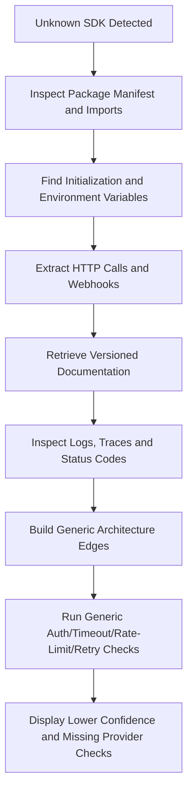

---

# 8. Large repository and monorepo architecture

```text
Repository
├── Workspace
│   ├── Application
│   │   ├── Service
│   │   │   ├── Package
│   │   │   │   ├── File
│   │   │   │   │   └── Symbol
```

## Scaling mechanisms

- distributed indexing queues,
- content hashes,
- changed-file-only processing,
- reuse of unchanged ASTs and embeddings,
- service-level graph partitions,
- hierarchical summaries,
- service-first retrieval,
- parallel parser workers,
- backpressure and quotas,
- separate artifact storage,
- dead-letter handling,
- per-tenant resource budgets.

## Large-repository routing

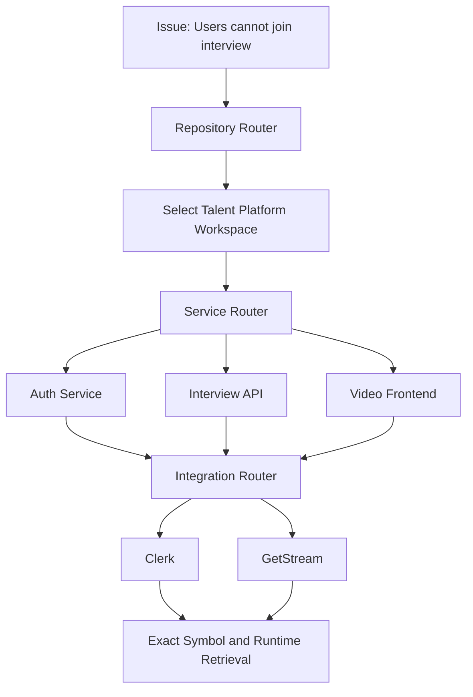

---

# 9. Repository indexing and architecture graph

## Indexing pipeline

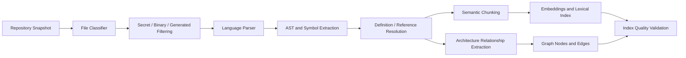

## Semantic chunk types

- function,
- method,
- class,
- interface,
- component,
- API route,
- middleware,
- database query,
- queue producer,
- queue consumer,
- Inngest function,
- webhook,
- Docker service,
- Kubernetes resource,
- test suite.

## Graph nodes

- application,
- service,
- package,
- file,
- symbol,
- route,
- database,
- table/collection,
- queue/topic/event,
- worker/background job,
- cache,
- external SDK,
- webhook,
- Docker container,
- Kubernetes resource,
- deployment,
- secret/configuration.

## Graph edges

```text
IMPORTS
CALLS
DEPENDS_ON
READS_FROM
WRITES_TO
QUERIES
PUBLISHES_TO
CONSUMES_FROM
TRIGGERS
AUTHENTICATES_WITH
CALLS_EXTERNAL
RECEIVES_WEBHOOK_FROM
GENERATES_TOKEN_FOR
USES_SECRET
DEPLOYED_AS
RUNS_IN
CONFIGURED_BY
INVALIDATES
```

Every edge stores file and line evidence.

---

# 10. Complete RAG architecture

## Knowledge stores

### Code RAG

- code,
- tests,
- configuration,
- schemas,
- infrastructure,
- CI/CD.

### Architecture GraphRAG

- service dependencies,
- data flows,
- request flows,
- event paths,
- SDK relationships,
- blast radius.

### Runtime RAG

- log clusters,
- error signatures,
- trace summaries,
- metric anomalies,
- DB and queue telemetry,
- container and Kubernetes events.

### Documentation RAG

- official language/framework/SDK docs,
- version-specific API references,
- OpenAPI/protobuf schemas,
- migration guides.

### Incident memory

- confirmed root causes,
- successful fixes,
- failed repairs,
- recovery outcomes.

### Project/team knowledge

- runbooks,
- ownership,
- coding conventions,
- normal commands,
- expected performance ranges.

## RAG working flow

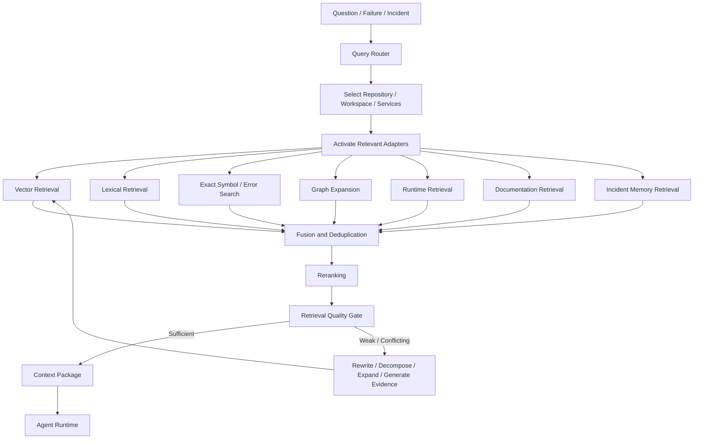

## Retrieval retry strategies

1. add exact stack-trace and error terms,
2. split broad queries,
3. widen or correct service/path filters,
4. switch vector/lexical/symbol/reference retrieval,
5. expand architecture neighbors,
6. retrieve parent/caller/callee/config/tests,
7. compare recent commits and deployments,
8. retrieve runtime telemetry,
9. retrieve version-aware SDK documentation,
10. generate new evidence with a safe tool,
11. stop honestly when evidence is unavailable.

## Context package

```text
Objective
Current plan and hypotheses
Affected architecture neighborhood
Relevant code and configuration
Relevant tests
Runtime evidence
Deployment changes
SDK documentation
Previous incidents
Available tools
Policies and budgets
Missing evidence and confidence
```

---

# 11. Custom agentic AI runtime from scratch

The underlying LLM may be an open-weight model or API model. The orchestration is your own implementation.

## Components

- durable orchestrator,
- explicit state machine,
- planner,
- replanner,
- context builder,
- model gateway,
- structured decision validator,
- tool registry,
- policy engine,
- hypothesis engine,
- evidence store,
- memory manager,
- evaluator,
- retry scheduler,
- checkpoint/resume,
- budgets and loop detection,
- multi-agent dispatcher,
- observability and evaluation.

## State machine

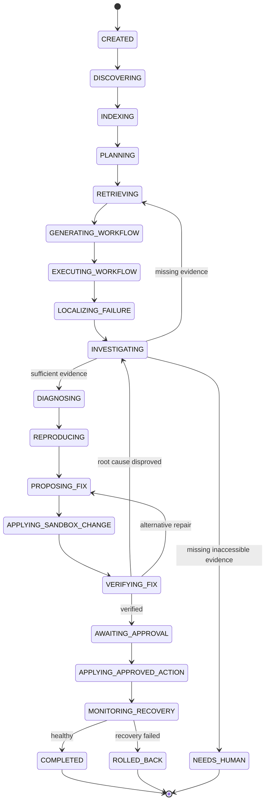

## Agent execution loop

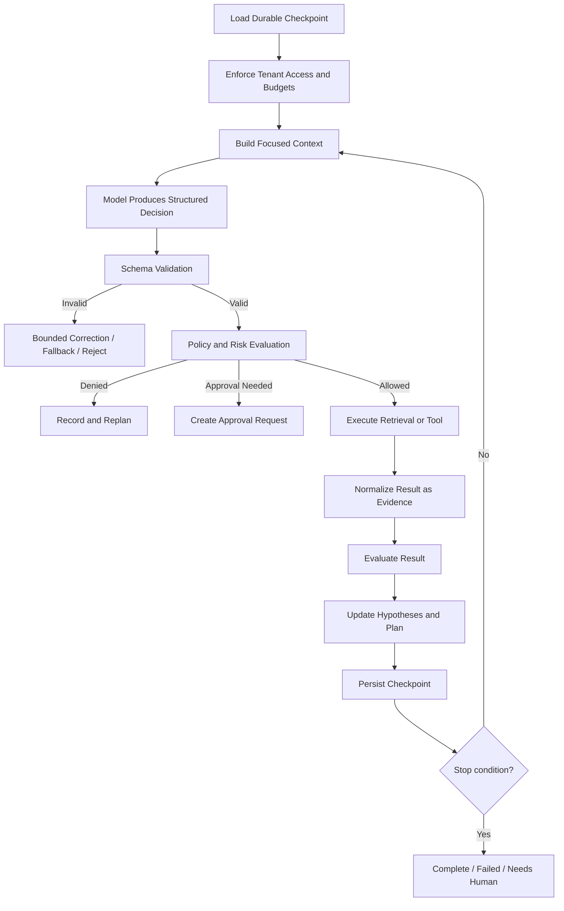

## Structured decisions

```ts
type AgentDecision =
  | { type: "retrieve"; request: RetrievalRequest }
  | { type: "call_tool"; tool: string; arguments: unknown }
  | { type: "update_hypotheses"; updates: HypothesisUpdate[] }
  | { type: "replan"; reason: string }
  | { type: "propose_change"; plan: RemediationPlanDraft }
  | { type: "request_approval"; approval: ApprovalDraft }
  | { type: "complete"; conclusion: EvidenceBackedConclusion }
  | { type: "needs_human"; missingEvidence: string[] };
```

## Retry classifications

```text
TRANSIENT
RATE_LIMITED
TIMEOUT
DEPENDENCY_UNAVAILABLE
INVALID_INPUT
AUTHORIZATION_FAILED
POLICY_DENIED
NON_IDEMPOTENT_RISK
UNSUPPORTED
PERMANENT
```

Only safe categories are retried.

## Agent budgets

- model attempts,
- retrieval rounds,
- tool attempts,
- repair attempts,
- state transitions,
- graph depth,
- tokens,
- cost,
- elapsed time,
- duplicate-action detection,
- no-progress detection.

---

# 12. Multi-agent design

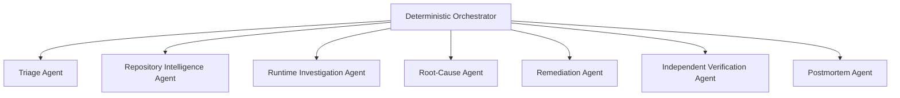

## Responsibilities

### Triage Agent

- severity,
- duplicate incidents,
- affected service,
- likely owner,
- user impact.

### Repository Intelligence Agent

- code,
- graph,
- dependencies,
- configuration,
- Git history.

### Runtime Investigation Agent

- logs,
- metrics,
- traces,
- DB,
- queues,
- SDK responses,
- containers and Kubernetes.

### Root-Cause Agent

- hypotheses,
- evidence comparison,
- confidence,
- missing evidence.

### Remediation Agent

- alternative corrections,
- exact change set,
- risk,
- rollback.

### Verification Agent

- independent workflow replay,
- tests,
- regression gates,
- accept/reject.

### Postmortem Agent

- timeline,
- root cause,
- impact,
- corrective and preventive actions.

Start with one reliable orchestrator. Split into agents only after benchmarks show improvement.

---

# 13. Agent tools

## Repository tools

```text
list_files
read_file
search_text
search_symbol
find_references
query_architecture_graph
get_git_diff
get_commit_history
retrieve_code_context
```

## Static tools

```text
run_compiler
run_linter
run_dependency_scan
scan_secrets
analyse_docker
analyse_kubernetes
analyse_database_schema
analyse_sdk_configuration
```

## Runtime tools

```text
query_logs
query_metrics
query_traces
inspect_database
inspect_cache
inspect_queue
inspect_background_job
inspect_container
inspect_kubernetes
get_deployment_history
inspect_external_sdk
```

## Workflow tools

```text
discover_workflows
generate_workflow
create_test_identity
seed_test_data
send_http_request
execute_graphql
drive_browser
open_websocket
simulate_webhook
publish_test_event
wait_for_background_job
assert_database_state
assert_cache_state
assert_queue_state
assert_sdk_state
assert_ui_state
```

## Modification tools

```text
create_temporary_branch
apply_patch_in_sandbox
revert_patch
run_verification_suite
prepare_pull_request
```

## Approved production tools

```text
restart_deployment
scale_workers
pause_queue
resume_queue
rollback_deployment
restore_configuration
disable_feature_flag
```

---

# 14. Static-analysis workflow

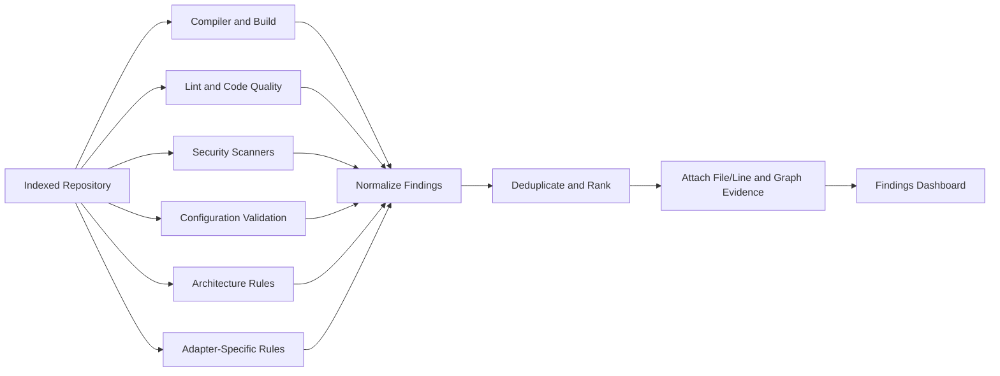

## Examples detected statically

### Frontend

- incorrect API path,
- invalid request/response type,
- hook dependency error,
- CodeMirror extension conflict,
- leaked event listener,
- exposed client secret.

### Backend

- missing route,
- wrong middleware order,
- unhandled promise,
- incorrect validation,
- authorization gap,
- resource leak.

### Database

- missing index,
- unbounded query,
- unsafe migration,
- oversized pool,
- transaction misuse.

### Background jobs

- event-name mismatch,
- queue-name mismatch,
- missing retry,
- retry storm,
- missing idempotency,
- missing graceful shutdown.

### Infrastructure

- wrong Docker hostname,
- port mismatch,
- missing readiness probe,
- missing secret,
- unsafe permissions,
- broken CI command.

---

# 15. Secure Runtime Lab

## Environment resolution

```text
opspilot.yaml
→ devcontainer
→ Docker Compose
→ Dockerfile
→ CI workflow
→ buildpack
→ adapter-detected commands
→ README instructions
→ AI-proposed environment
→ manual configuration
```

## Sandbox lifecycle

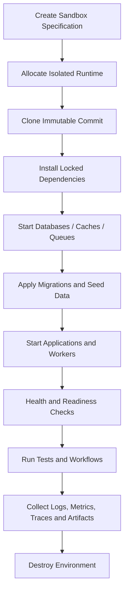

## Isolation

- non-root,
- read-only base filesystem,
- temporary writable volume,
- CPU/memory/disk/process quotas,
- network deny-by-default,
- allowed domains only,
- no host filesystem,
- no host Docker socket,
- no production credentials,
- timeout and cleanup,
- gVisor/Firecracker-class isolation for hosted execution.

---

# 16. End-to-end synthetic workflow engine

## Workflow discovery sources

- frontend API calls,
- backend routes,
- OpenAPI,
- GraphQL,
- protobuf,
- Postman/Insomnia,
- existing tests,
- CI workflows,
- recorded traces,
- user definitions,
- previous incidents,
- agent generation.

## Complete verification path

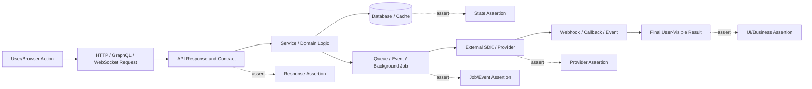

## Example: create and join interview

```text
1. Create test user.
2. Authenticate with Clerk.
3. POST /api/interviews.
4. Verify 201 and response contract.
5. Verify MongoDB interview record.
6. Verify interview.created event.
7. Verify Inngest function execution.
8. Verify GetStream room creation.
9. Verify notification job.
10. Open interview page in browser.
11. Verify room link is visible.
12. Join room using generated token.
13. Verify final user-visible success.
```

A `201` response alone does not mean the workflow passed.

---

# 17. Testing architecture

## Testing pyramid and runtime tests

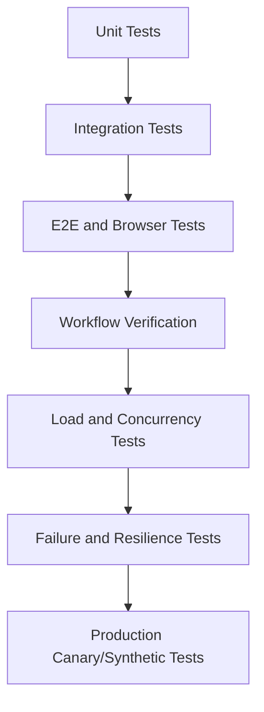

## Load testing

Measure:

- throughput,
- P50/P95/P99 latency,
- error rate,
- CPU and memory,
- DB connections,
- Redis latency,
- queue depth,
- worker throughput,
- provider rate limits.

## Concurrency tests

- duplicate requests,
- simultaneous webhooks,
- concurrent updates,
- race conditions,
- locks,
- idempotency,
- duplicate jobs.

## Failure injection

- stop Redis,
- delay database,
- exhaust connection pool,
- crash worker,
- duplicate webhook,
- provider timeout,
- expired token,
- wrong environment variable,
- CPU throttling,
- memory limit,
- packet loss,
- Kubernetes pod termination.

---

# 18. Debugging and root-cause workflow

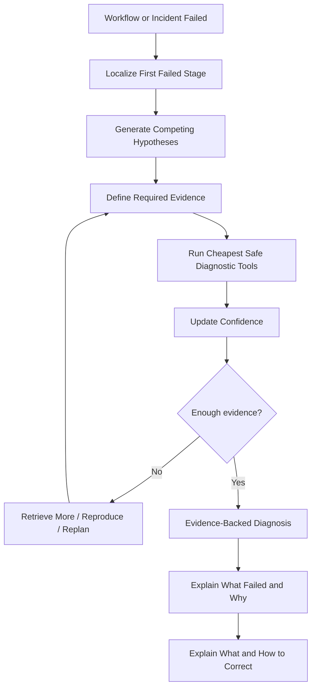

## Diagnosis output

- failed stage,
- probable root cause,
- confidence,
- supporting evidence,
- contradicting evidence,
- missing evidence,
- affected files and services,
- architecture path,
- user impact,
- reproduction result,
- recommended correction.

## Example

```text
Last successful stage:
interview.created event published

First failed stage:
Inngest function execution

Root cause:
API emitted "interview.created", but function listens for "interviews.created"

Confidence:
97%

Evidence:
- source lines,
- emitted event trace,
- no matching Inngest execution,
- function trigger definition.
```

---

# 19. Autonomous remediation and approval workflow

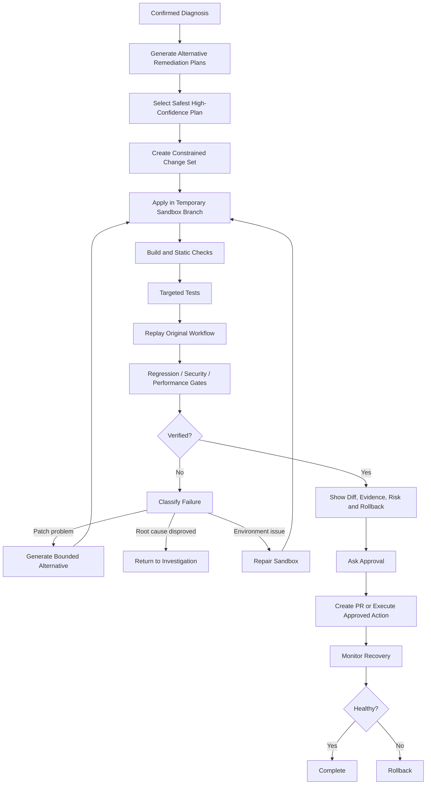

## Automatic before approval

- analysis,
- retrieval,
- telemetry queries,
- hypotheses,
- sandbox creation,
- temporary patch,
- build,
- tests,
- workflow replay,
- verification.

## Approval required

- push branch,
- open PR if policy requires,
- merge,
- staging/production configuration,
- restart or scale,
- secrets,
- migrations,
- production rollback/deployment.

## Approval card shown in frontend

```text
Verified correction available

Problem:
Inngest event-name mismatch

Files changed:
2

Risk:
Low

Verification:
✓ Original failure reproduced
✓ Build passed
✓ Workflow passed after change
✓ 18 regression tests passed
✓ No critical security regression

Actions:
[Review Diff] [Approve and Create PR] [Reject]
```

---

# 20. Dynamic multi-SDK debugging

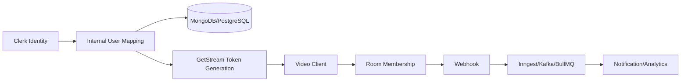

The system correlates:

- user IDs,
- request IDs,
- trace IDs,
- event IDs,
- queue job IDs,
- provider object IDs,
- webhook IDs,
- deployment SHAs.

Problems it can investigate:

- SDK identity mismatch,
- test/live configuration mismatch,
- expired token,
- missing secret,
- duplicate webhook,
- event ordering,
- stale cache,
- failed database-to-event handoff,
- rate limit,
- retry storm,
- queue lag,
- listener leak,
- Docker/Kubernetes networking,
- provider outage.

---

# 21. Production incident workflow

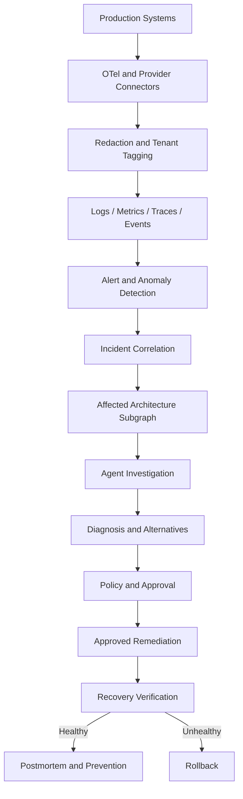

## Correlation example

```text
Deployment abc123 at 10:05
+ worker error spike at 10:07
+ DB connections reached limit at 10:08
+ queue backlog began at 10:08
= one correlated incident
```

---

# 22. Frontend-visible product

The frontend must make the backend intelligence visible.

## Screen 1: Landing and authentication

Shows:

- product explanation,
- supported workflows,
- sample investigation,
- login and signup,
- GitHub connection CTA.

## Screen 2: Organization and project setup

Shows:

- organization creation,
- member invitations,
- role assignment,
- plan and usage,
- integrations.

## Screen 3: Connect repository

Visible flow:

```text
Install GitHub App
→ select repository
→ select branch/directory
→ start analysis
```

## Screen 4: Live indexing

Shows live events:

```text
Discovering repository...
Parsing TypeScript service...
Indexing Java service...
Detecting MongoDB...
Mapping Inngest functions...
Generating embeddings...
Building architecture graph...
Running static checks...
```

## Screen 5: Repository overview

Cards:

- detected stack,
- capability coverage,
- services,
- databases/queues/SDKs,
- build status,
- architecture/security/reliability scores,
- high-risk findings,
- recent workflows and incidents.

## Screen 6: Architecture explorer

Views:

- service map,
- request flow,
- data flow,
- event/queue flow,
- SDK flow,
- infrastructure flow,
- failure impact,
- commit comparison.

Clicking a node shows:

- files and symbols,
- evidence lines,
- dependencies,
- environment variables,
- runtime health,
- recent changes and incidents.

## Screen 7: Findings

Each finding shows:

- severity,
- confidence,
- exact file and line,
- architecture path,
- deterministic evidence,
- potential impact,
- suggested investigation,
- “Run in Runtime Lab.”

## Screen 8: Workflow catalog

Shows:

- discovered workflows,
- source of discovery,
- supported protocols,
- risk level,
- last result,
- affected services.

Examples:

```text
User signup
Create interview
Join video room
Checkout subscription
Upload file
Process notification
```

## Screen 9: Workflow builder

Users can:

- select start action,
- add API/browser/event steps,
- define DB/queue/SDK/UI assertions,
- select test credentials,
- define cleanup,
- save and run.

## Screen 10: Runtime Lab

Shows:

- service cards,
- logs,
- health checks,
- database and queue status,
- command timeline,
- test controls,
- load controls,
- failure injection controls.

## Screen 11: Live workflow execution

```text
✓ Browser opened /interviews
✓ Clerk test user authenticated
✓ POST /api/interviews returned 201
✓ MongoDB document created
✓ interview.created event emitted
✗ Inngest function not executed
○ GetStream room not checked
○ UI room link not checked
```

Displays correlation path across all stages.

## Screen 12: Live agent investigation

Panels:

- current state,
- plan,
- hypotheses,
- confidence,
- retrieved evidence,
- tool calls,
- retry/replan events,
- token/cost usage.

## Screen 13: Diagnosis

Shows:

```text
What failed
Where it failed
Why it failed
What must be corrected
How to correct it
Evidence
Confidence
Missing evidence
```

## Screen 14: Automatic repair

Shows:

- generated alternatives,
- selected plan,
- files being changed,
- build attempts,
- workflow replay,
- regression gates,
- rejected attempts.

## Screen 15: Approval and patch review

Shows:

- full Git diff,
- configuration changes,
- tests,
- before/after telemetry,
- risk,
- rollback,
- exact external action,
- approve/reject/request changes.

## Screen 16: Incidents

Shows:

- active incidents,
- severity,
- affected services,
- incident timeline,
- agent progress,
- approvals,
- recovery.

## Screen 17: Evaluation

Shows:

- retrieval accuracy,
- root-cause accuracy,
- successful-fix rate,
- false-fix rate,
- tool accuracy,
- retry recovery,
- regression rate,
- latency and cost,
- model comparison.

## Screen 18: Billing, usage and settings

Shows:

- plan,
- usage,
- repository limits,
- sandbox minutes,
- telemetry volume,
- invoices,
- retention,
- integrations,
- roles and audit logs.

---

# 23. Frontend-to-backend working flow

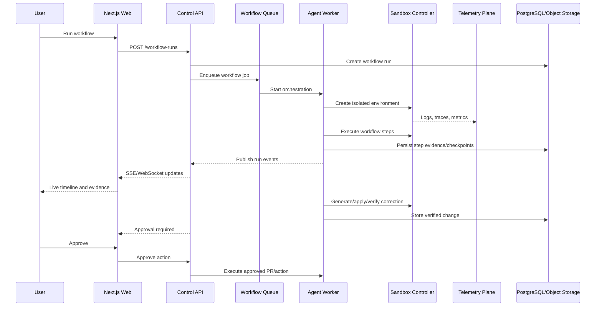

---

# 24. SaaS control-plane architecture

## Authentication and access

- OAuth and credentials,
- sessions,
- organization membership,
- project-scoped permissions,
- environment-specific permissions,
- two-person approvals for high-risk actions.

## Billing and usage dimensions

- connected repositories,
- indexed files/symbols,
- storage,
- agent runs,
- model tokens,
- sandbox minutes,
- workflow runs,
- telemetry ingestion,
- retention,
- production connectors,
- members.

## Admin functions

- tenant search,
- worker and queue health,
- failed jobs,
- dead-letter jobs,
- billing exceptions,
- feature flags,
- model/provider controls,
- connector availability,
- cost and abuse limits,
- emergency disabling of risky tools.

---

# 25. Core data model

## SaaS

```text
users
sessions
organizations
memberships
roles
permissions
projects
repositories
github_installations
integrations
encrypted_secrets
subscriptions
invoices
usage_records
audit_logs
notifications
feature_flags
```

## Repository intelligence

```text
repository_snapshots
repository_workspaces
applications
services
packages
repository_files
symbols
references
code_chunks
chunk_embeddings
graph_nodes
graph_edges
architecture_versions
capability_profiles
adapter_executions
documentation_sources
```

## RAG and agents

```text
retrieval_rounds
retrieval_candidates
retrieval_quality_assessments
retrieval_feedback
agent_runs
agent_steps
agent_checkpoints
plans
plan_steps
hypotheses
evidence
tool_calls
tool_execution_attempts
model_calls
model_call_attempts
memory_records
budget_records
```

## Runtime and workflow

```text
sandboxes
sandbox_services
build_runs
test_runs
load_test_runs
failure_injections
synthetic_workflows
workflow_versions
workflow_steps
workflow_runs
workflow_step_runs
workflow_assertions
workflow_fixtures
workflow_correlations
failure_boundaries
artifacts
```

## Repair and approval

```text
diagnoses
remediation_plans
remediation_alternatives
change_sets
change_set_files
verification_plans
verification_runs
verification_assertions
risk_assessments
approval_requests
approved_actions
pull_requests
recovery_monitors
rollback_executions
```

## Production incidents

```text
telemetry_sources
incidents
incident_events
incident_services
alert_rules
deployment_events
remediation_actions
postmortems
```

---

# 26. Main API groups

## Organizations, users and billing

```text
POST /api/organizations
POST /api/organizations/:id/invitations
GET  /api/organizations/:id/members
GET  /api/usage
GET  /api/billing
POST /api/subscriptions
GET  /api/audit-logs
```

## Repositories

```text
POST /api/projects
POST /api/projects/:id/repositories
POST /api/repositories/:id/index
GET  /api/repositories/:id/status
GET  /api/repositories/:id/capabilities
GET  /api/repositories/:id/architecture
GET  /api/repositories/:id/findings
```

## Workflows

```text
POST /api/projects/:id/workflows/discover
POST /api/projects/:id/workflows
GET  /api/projects/:id/workflows
POST /api/workflows/:id/run
POST /api/workflows/:id/replay
GET  /api/workflow-runs/:id
GET  /api/workflow-runs/:id/stream
GET  /api/workflow-runs/:id/evidence
```

## Agents and repairs

```text
POST /api/workflow-runs/:id/investigate
GET  /api/agent-runs/:id
GET  /api/agent-runs/:id/stream
GET  /api/diagnoses/:id
POST /api/diagnoses/:id/remediation-plans
POST /api/remediation-plans/:id/verify
POST /api/remediation-plans/:id/request-approval
```

## Approval and actions

```text
POST /api/approvals/:id/approve
POST /api/approvals/:id/reject
POST /api/approvals/:id/request-changes
POST /api/approved-actions/:id/execute
GET  /api/approved-actions/:id/recovery
POST /api/approved-actions/:id/rollback
```

## Incidents

```text
GET  /api/incidents
GET  /api/incidents/:id
POST /api/incidents/:id/investigate
POST /api/incidents/:id/comments
GET  /api/incidents/:id/timeline
```

---

# 27. Internal event architecture

```text
repository.connected
repository.snapshot.created
capability.detected
workspace.discovered
service.discovered
indexing.started
indexing.completed
architecture.generated
analysis.started
finding.created
workflow.discovered
workflow.run.requested
workflow.step.started
workflow.step.completed
workflow.assertion.failed
workflow.failed
workflow.passed
failure.boundary.localized
agent.started
agent.replanned
agent.checkpoint.created
retrieval.retry.requested
retrieval.retry.completed
tool.retry.requested
model.retry.requested
diagnosis.completed
remediation.plan.created
sandbox.change.applied
verification.started
verification.failed
verification.passed
approval.requested
approval.approved
approved_action.started
approved_action.completed
recovery.failed
rollback.started
rollback.completed
postmortem.created
budget.exhausted
dead_letter.created
```

Every event carries:

- organization,
- project,
- environment,
- source entity,
- commit,
- correlation ID,
- idempotency key,
- timestamp.

---

# 28. Security architecture

## Threats

- malicious repository scripts,
- prompt injection in source comments or README,
- dependency lifecycle attacks,
- cloud-metadata access,
- secret exfiltration,
- cross-tenant leakage,
- destructive agent actions,
- excessive resource consumption,
- sensitive telemetry leakage,
- blind retries of non-idempotent actions.

## Controls

- repository text treated as untrusted data,
- tool permissions outside the LLM,
- schema validation,
- deterministic policies,
- tenant-scoped SQL/vector/cache/object storage,
- encrypted secrets,
- short-lived connector tokens,
- sensitive-data redaction,
- isolated execution,
- restricted networking,
- approval boundaries,
- audit logging,
- retry classification,
- action idempotency,
- rollback and circuit breakers.

---

# 29. Evaluation architecture

## Seeded benchmark failures

- Redis hostname mismatch,
- BullMQ queue-name mismatch,
- Inngest event-name mismatch,
- PostgreSQL connection leak,
- MongoDB missing index,
- Stripe webhook raw-body failure,
- Clerk token-forwarding failure,
- GetStream identity mismatch,
- Kubernetes readiness failure,
- memory-limit crash,
- duplicate webhook,
- retry storm,
- frontend/backend contract mismatch,
- CodeMirror listener leak.

## Metrics

### Repository and RAG

- service-routing accuracy,
- correct-file Recall@K,
- correct-symbol Recall@K,
- Precision@K,
- retrieval retry recovery,
- evidence coverage,
- stale-document rate.

### Agent

- root-cause accuracy,
- top-three accuracy,
- tool-selection accuracy,
- invalid-tool rate,
- no-progress rate,
- successful resume after failure.

### Repair

- successful-fix rate,
- false-fix rate,
- regression rate,
- original-workflow recovery,
- average repair attempts.

### Operational

- latency,
- tokens,
- monetary cost,
- sandbox usage,
- telemetry storage,
- approval acceptance,
- rollback rate.

---

# 30. Deployment topology

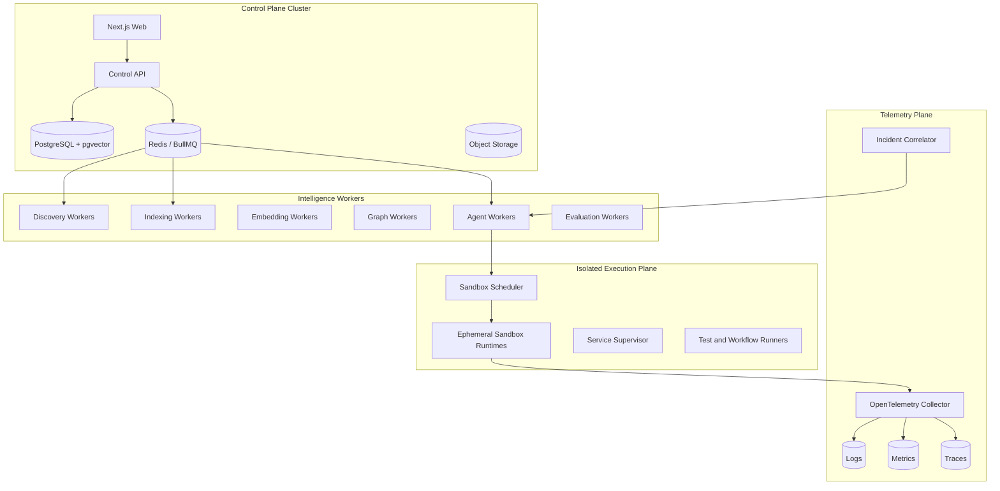

The execution plane should use separate nodes/account/network boundaries from the control plane.

---

# 31. Recommended repository structure

```text
opspilot/
├── apps/
│   ├── web/
│   ├── control-api/
│   ├── github-worker/
│   ├── discovery-worker/
│   ├── indexer-worker/
│   ├── graph-worker/
│   ├── agent-worker/
│   ├── sandbox-controller/
│   ├── telemetry-api/
│   ├── incident-worker/
│   └── evaluation-worker/
├── packages/
│   ├── agent-runtime/
│   ├── rag/
│   ├── repository-intelligence/
│   ├── workflow-engine/
│   ├── remediation-engine/
│   ├── adapter-sdk/
│   ├── tool-registry/
│   ├── policy-engine/
│   ├── memory/
│   ├── model-gateway/
│   ├── schemas/
│   ├── database/
│   ├── observability/
│   └── shared/
├── adapters/
│   ├── languages/
│   ├── frameworks/
│   ├── databases/
│   ├── messaging/
│   ├── integrations/
│   ├── deployment/
│   └── generic/
├── connectors/
│   ├── github/
│   ├── docker/
│   ├── kubernetes/
│   ├── otel/
│   ├── postgres/
│   ├── mongodb/
│   ├── redis/
│   ├── inngest/
│   ├── getstream/
│   ├── stripe/
│   └── clerk/
├── sandbox/
├── benchmarks/
├── infrastructure/
└── docs/
```

---

# 32. Implementation roadmap

## Phase 0 — Contracts and benchmarks

Build:

- core schemas,
- state machine contracts,
- evidence and finding schemas,
- workflow model,
- tool model,
- policy model,
- seeded repositories and expected results.

## Phase 1 — SaaS foundation

Build:

- auth,
- organizations,
- RBAC,
- projects,
- audit,
- basic usage,
- dashboard shell.

## Phase 2 — GitHub and snapshots

Build:

- GitHub App,
- repository selection,
- exact commits,
- push synchronization,
- repository browser.

## Phase 3 — Universal discovery and adapters

Build:

- capability detector,
- adapter SDK,
- generic fallback,
- TypeScript/JavaScript support first.

## Phase 4 — Indexing and graph

Build:

- parsing,
- symbols,
- chunks,
- embeddings,
- lexical index,
- graph,
- frontend explorer.

## Phase 5 — RAG and retry

Build:

- hybrid retrieval,
- filtering,
- fusion,
- reranking,
- quality gates,
- query rewrite,
- retries,
- observability.

## Phase 6 — Static audit

Build:

- compiler,
- lint,
- secrets,
- configuration,
- Docker/Kubernetes,
- initial integration rules.

## Phase 7 — Custom single-agent runtime

Build:

- durable state,
- planner,
- tools,
- hypotheses,
- evidence,
- policies,
- checkpoints,
- budgets,
- retry/fallback.

## Phase 8 — Secure Runtime Lab

Build:

- sandbox controller,
- dependency resolver,
- service startup,
- telemetry,
- test runner,
- cleanup.

## Phase 9 — Workflow engine

Build:

- workflow discovery,
- HTTP/browser drivers,
- DB/queue/SDK/UI assertions,
- correlation,
- failure localization.

## Phase 10 — Dynamic and resilience testing

Build:

- load,
- concurrency,
- failure injection,
- performance reports.

## Phase 11 — Automated remediation

Build:

- remediation plans,
- constrained patches,
- temporary branches,
- replay,
- verification gates,
- alternative repair loop.

## Phase 12 — Approval and Git

Build:

- approval cards,
- PR creation,
- audit,
- rollback plans.

## Phase 13 — Deep adapters

Add:

- MongoDB,
- Redis/BullMQ,
- Inngest,
- Clerk,
- Stripe,
- GetStream,
- Docker/Kubernetes.

## Phase 14 — Production telemetry and incidents

Build:

- OTel,
- connectors,
- anomaly rules,
- incident correlation,
- production approvals,
- recovery monitoring.

## Phase 15 — Multi-agent separation

Split roles only when single-agent benchmarks are reliable.

## Phase 16 — Complete SaaS

Build:

- billing,
- full usage,
- retention,
- admin,
- collaboration,
- reporting,
- public APIs and webhooks.

## Phase 17 — Evaluation gates

No model, RAG, prompt, tool or adapter change releases without benchmarks.

---

# 33. First complete vertical slice

Do not start by building every feature.

The first complete proof should be:

```mermaid
flowchart TD
    A[Connect TypeScript Repository] --> B[Index and Generate Architecture]
    B --> C[Detect Express/Next.js, MongoDB, Redis and Inngest]
    C --> D[Discover Create Interview Workflow]
    D --> E[Start Runtime Lab]
    E --> F[Send API Request and Verify MongoDB]
    F --> G[Verify Inngest Event and Function]
    G --> H[Inject Event-Name Mismatch]
    H --> I[Localize Failed Inngest Stage]
    I --> J[Agent Diagnoses with Evidence]
    J --> K[Generate One-Line Correction]
    K --> L[Apply in Sandbox and Replay]
    L --> M[Pass Workflow and Regressions]
    M --> N[Ask Approval]
    N --> O[Create Draft PR]
```

This vertical slice proves the core product.

---

# 34. Best recruiter demonstration

```text
1. Sign in and create an organization.
2. Connect a private polyglot repository.
3. Watch languages, services, databases, queues and SDKs get detected.
4. Open the evidence-backed architecture graph.
5. Show static issues.
6. Open the discovered workflow catalog.
7. Run “Create and join interview.”
8. Watch browser/API/database/Inngest/GetStream/UI stages live.
9. Inject a cross-SDK or Inngest failure.
10. Show the exact first failed stage.
11. Watch hypotheses, RAG retrieval, tool calls and confidence.
12. Show exact root-cause evidence.
13. Generate and apply a correction in sandbox.
14. Replay the same workflow.
15. Show regression, security and performance gates.
16. Review the diff, risk and rollback.
17. Approve and create a draft PR.
18. Show evaluation scores, token cost and investigation time.
```

This visibly demonstrates:

- full-stack SaaS,
- AI engineering,
- RAG,
- agentic AI,
- distributed systems,
- databases and queues,
- SDK debugging,
- DevOps,
- observability,
- security,
- testing,
- automated repair.

---

# 35. What architecture alone means

An architecture document can define all target features, components, contracts and workflows.

It does **not** mean all features work merely because they are documented.

For each feature, implementation must include:

```text
Frontend screen
+ API endpoint
+ database model
+ queue/event
+ worker/service
+ authorization and policy
+ observability
+ tests
+ failure handling
+ evaluation
```

A feature should not be called complete until its complete vertical path works.

---

# 36. Final definition of done

The complete platform is considered implemented when it can demonstrate, without hard-coded results:

1. Public and private repository connection.
2. Tenant isolation and RBAC.
3. Polyglot technology discovery.
4. Large-repository decomposition.
5. Incremental syntax/semantic indexing.
6. Evidence-backed architecture graphs.
7. Hybrid RAG with quality gates and retry.
8. Static build, security and configuration findings.
9. Durable custom agent planning and tool execution.
10. Safe isolated repository execution.
11. Automatic workflow discovery or definition.
12. Active HTTP/browser/WebSocket/webhook/event execution.
13. API, DB, queue, background job, SDK and UI assertions.
14. First-failed-stage localization.
15. Evidence-backed root-cause diagnosis.
16. Exact correction explanation and change generation.
17. Sandbox-only automatic patching before approval.
18. Original-workflow replay.
19. Regression, security and performance verification.
20. Approval-controlled Git or infrastructure actions.
21. Recovery monitoring and rollback.
22. Live frontend visibility for every important stage.
23. Production telemetry and incident correlation.
24. Billing, usage, audit, retention and administration.
25. Repeatable benchmarks proving RAG, agent, repair and safety quality.

---

# 37. Final central workflow

```mermaid
flowchart LR
    A[Repository] --> B[Understand]
    B --> C[Index and Graph]
    C --> D[Static Audit]
    D --> E[Run Complete Workflow]
    E --> F[Verify All Side Effects]
    F --> G{Success?}
    G -->|Yes| H[Report Healthy]
    G -->|No| I[Localize Failure]
    I --> J[Agentic Investigation]
    J --> K[RAG + Tools + Evidence]
    K --> L[Generate Correction]
    L --> M[Apply in Sandbox]
    M --> N[Replay and Verify]
    N --> O{Verified?}
    O -->|No| P[Replan / Alternative / Needs Human]
    O -->|Yes| Q[Ask Approval]
    Q --> R[PR or Approved Action]
    R --> S[Monitor Recovery]
    S --> T[Complete or Roll Back]
```

## One-sentence definition

> OpsPilot AI is a universal, adapter-driven SaaS that understands repositories, actively exercises complete application workflows, diagnoses failures across code, infrastructure, databases, queues, background jobs and external SDKs, automatically verifies candidate corrections in a secure sandbox, and asks for approval before applying the verified change outside that sandbox.
